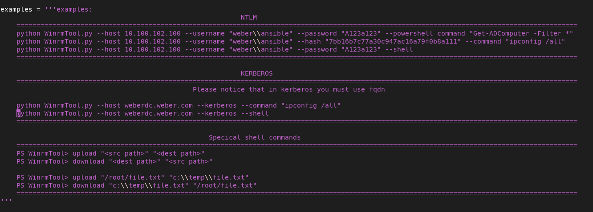

# WinrmTool
This Tool is using python 2.7, if you want to change to python3 just switch between the **raw_input** to **input**.

### Installation guide
to install it just run the command:
```bash
  pip install -r requirements.txt
```
and then you can run the tool like that:
```bash
  python WinRMTool.py --host weberdc.weber.com --kerberos --shell
 ```
### Command Line Usage
you can use this command line tool in order to connect to another computer using the winrm protocol.                                                                        
you have couple of choices how to connect:                                                                                                                  
1) kerberos (neet to get tgt outside this shell with kinit, or by connecting with domain user on **linux** domain joined host.                                               
2) ntlm (also support pass the hash using the nt hash).                                                                                                                        
                                                                                                                                                                             
and for running commands, you can use:                                                                                                                                        
1) command (cmd command).                                                                                                                                                  
2) Powershell-command.                                                                                                                                                           
3) Powershell-script.                                                                                                                                                        
4) Powershell-Shell.                                                                                                                                                            

**This tool also support special shell commands for uploading and downloading file from and to the destination computer, see in the example section of the help menu**             

you can see all the options and running examples in the help menu when running:                                                                                                   
```bash
  python WinRMTool.py --help
```


